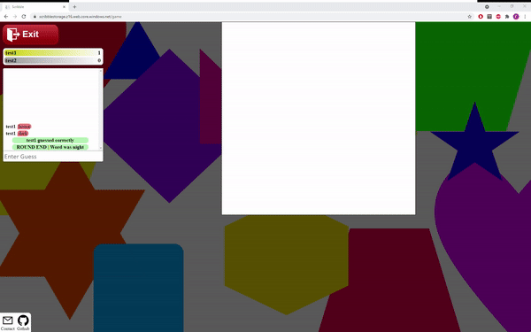
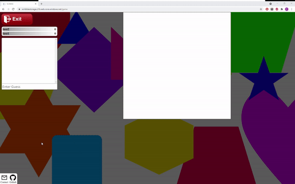

## Serverless React.js Scribble Hosted With Azure Using Functions and SignalR

[![MIT License][license-shield]][license-url]
[![LinkedIn][linkedin-shield]][linkedin-url]

### [DEMO](https://scribblestorage.z16.web.core.windows.net/) 
(Note: There is proably going to be a cold start of the azure function so the first request to a Azure function may take some time a few seconds)

<p align="center" float="left">
  
  
</p>


<details open="open">
  <summary>Content</summary>
  <ol>
    <li>
      <a href="#about-the-project">About The Project</a>
      <ul>
        <li><a href="#how-to-play">How To Play</a></li>
        <li><a href="#architecture">Architecture</a></li>
        <li><a href="#built-with">Built With</a></li>
      </ul>
    </li>
    <li><a href="#setup-on-azure">Setup on Azure</a></li>
    <li><a href="#license">License</a></li>
    <li><a href="#contact">Contact</a></li>
  </ol>
</details>


### About The Project

This project is a real-time serverless multiplayer drawing game where one player receives a word and has to paint it while the other players in the lobby try to guess the word. It is hosted on Azure with the backend part as a Azure Function App written in .Net Core and the frontend hosted as a React.js Static Website in a Storage Account to save on cost. It also uses Azures SignalR service to provide a real-time application for the users.  

#### How To Play

#### Architecture

![alt text][architecture]

The backend part of the system is built solely with Azure functions and their durable extension for stateful lobby and game orchestration. The flow is as follows:
1. A client creates a game by supplying a username which starts a new LobbyOrchestration.
2. Any numbner of players can now join the game by supplying a username and the game code for that lobby.
  2,5. On join/create the player also connect to a SignalR group for that lobby which is now responible for sending events such as other players joining.
3. The lobby owner decides to start the game which signals SignalR and turns on the GameOrchestrator (represents a single round)
4. The GameOrchestrator now picks a painter and a random word taken from a generated storage table and sends signals to all players.
5. The painter can now see the word and paint on their canvas. Sending ajax requests to the Draw endpoint which then through the SignalR service sends that information to the other players, currently with a 2 second delay so that the receiver can process and not have to paint everything at once. 
6. Players are at the same time as the player is drawing able to send guesses to a api endpoint which validates it and either sends a message to other players that he was correct or if he was wrong it sends that guess to the other players to display in the chat. 
7. The GameOrchestrator restarts itself which creates a new round.


#### Built With

* [React](https://reactjs.org/) - Frontend
* [.Net Core](https://docs.microsoft.com/en-us/dotnet/fundamentals/) - Backend framework
* [Azure Functions](https://azure.microsoft.com/en-us/services/functions/) - Backend API and game loop

### Setup on Azure

1. Clone the repo
   ```sh
   git clone https://github.com/Bjorneer/serverless-scribble.git
   ```
2. Create Azure resources either through portal or cli (Resource Group, SignalR, Storage Account, Function App)
  ```sh
  az group create -n <RGNAME> -l <LOCATION>
  az signalr create --name <SIGNALRNAME> --resource-group <RGNAME> --sku Free --unit-count 1
  az storage account create -n <SANAME> -g <RGNAME> -l <LOCATION> --sku Standard_LRS
  az functionapp create --resource-group <RGNAME> --consumption-plan-location <LOCATION> --runtime dotnet --functions-version 3 --name <APPNAME> --storage-account <SANAME>
  ```
3. Setup frontend: 
    * Search and replace FUNCTIONAPP_URL with your newly created Funtion App api endppoint.
    * Navigate to /Scribble.Client/ClientApp the project navigate and run ```npm install``` and ```npm run build```
    * Go to your Azure Storage Account and enable Static Website aswell as set index and error document as index.html [Docs](https://docs.microsoft.com/en-us/azure/storage/blobs/storage-blob-static-website)
    * Move the content of the created build folder to the $web container
4. Setup backend:
    * Easiest way to setup your Function App is through Visual Studios [Docs](https://docs.microsoft.com/sv-se/azure/azure-functions/functions-develop-vs#publish-to-azure)
    * Add The AzureSignalRConnectionString to App Settings during publish or in portal

### License

Distributed under the MIT License. See `LICENSE` for more information.

### Contact

Filip Björnåsen - filip@mosquito.se

[license-shield]: https://img.shields.io/github/license/othneildrew/Best-README-Template.svg?style=for-the-badge
[license-url]: https://github.com/Bjorneer/serverless-scribble/blob/master/LICENSE
[linkedin-shield]: https://img.shields.io/badge/-LinkedIn-black.svg?style=for-the-badge&logo=linkedin&colorB=555
[linkedin-url]: https://www.linkedin.com/in/filip-bj%C3%B6rn%C3%A5sen-b07a7a1b3/
[architecture]: Assets/azure-scribble-architecture.PNG
